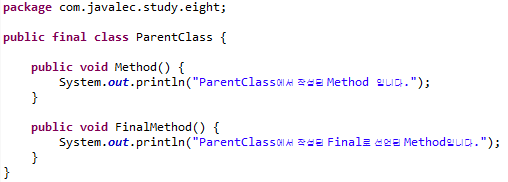
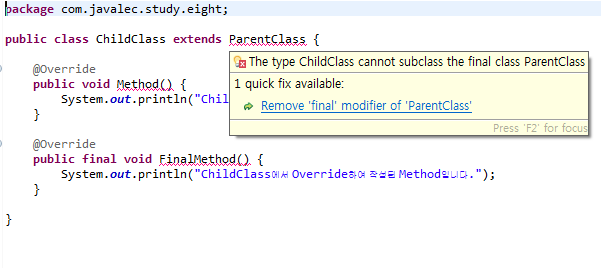
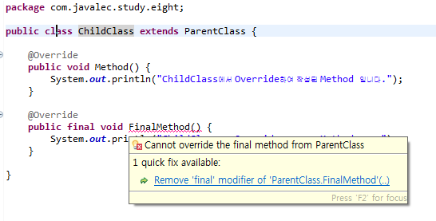
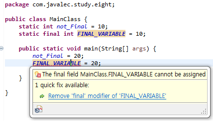

## 8. final 키워드
  final 키워드를 사용할 때 클래스, 메서드, 변수에 따라 각기 다른 성격을 가집니다.이에 대한 이해를 할 수 있는 코드를 작성해 봅니다.
  •final 키워드를 사용할 때 Thread와의 관계는 이번 단계에서는 다루지 않아도 됩니다.

  | fianl 선언 | 의미 |
  |---|:---:|
  | `final 클래스` | 상속 불가 클래스를 의미  |
  | `final 메소드` | 상속 받은 클래스 에서 오버라이딩 불가  |
  | `final 변수` | 변수값 초기화 가능/값 변경 불가(상수) |
  <br>  

  ```
  final로 선언된 클래스는 상속 불가 클래스를 의미한다
  ```
  <br>

`final로 선언한 클래스`
<br>
  
<br>


`final로 선언한 클래스 상속시 에러발생`
<br>
  
<br>

```
final로 선언된 메소드는 그 메소드가 포함된 클래스를 상속받은 클래스에서 오버라이딩을 통해 재정의가 불가능하다.
```

`final로 선언한 메서드`
<br>
  
<br>


`final로 선언한 메서드 override시 에러발생`
<br>
  
<br>

```
final로 선언된 변수는 값을 초기화만 할수 있고, 그 값의 변경 및 새로운 할당이 불가능한 상수가 된다.
```


`final로 선언한 변수 값 변경시 에러발생`
<br>

<br>
