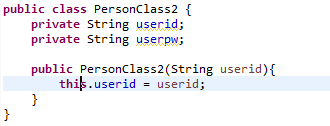
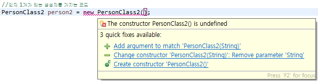

## 생성자 (1)

아무런 상태와 행위가 없는 새로운 클래스를 작성하면 눈에 보이지 않지만 어떤 작업도 수행하지 않는 기본 무인자(no arguments) 생성자를 추가합니다.

다음과 같이 무인 생성자의 특징을 이해는 코드를 작성해봅니다.

•무인 생성자만 가지는 코드


•인자 1개가 있는 생성자를 가지는 코드


•인자 1개가 있는 생성자를 가지는 클래스를 무인자 생성자로 인스턴스화하는 코드
<br>


`무인 생성자만 가지는 코드`
<br>

<br>
```
- 클래스 내부에 생성자 선언을 생략했다면 컴파일러는 기본생성자(default)를 byte코드에 자동으로 추가한다.
- 클래스에 정의된 생성자가 하나도없을때만 컴파일러가 자동으로 기본 생성자를 만든다.
```
<br>

`인자 1개가 있는 생성자를 가지는 코드`
<br>

<br>

`인자 1개가 있는 생성자를 가지는 클래스를 무인자 생성자로 인스턴스화 하는 코드`

<br>

<br>

```
  기본적으로 생성자가 없는경우 jvm이 컴파일할때 매개변수가 없는 생성자를 만들어 주지만
  클래스가 생성자를 1개 이상 만들 경우 default생성자가 존재하지않아 에러가 발생한다.    
```
