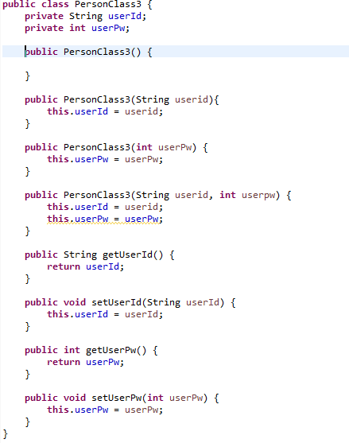
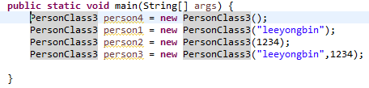

## 생성자 (2)

위 1번 항목의 3번째 코드는 에러가 발생하는데요.

에러가 발생되지 않도록 코드를 작성하고 이해하도록 합니다.
<br>

`생성자 Overoading`


<br>


<br><br>

```
생성자 오버로딩 조건
- 생성자 오버로딩을 통하여 하나의 클래스에 여러개의 다른 생성자를 만들 수 있다.
- 같은 클래스 내에서 이루어져야만 하고 선언된 매개변수 타입의 순서와 개수가 달라야 한다.
- 오버로딩을 통하여 여러종류의 인자를 받는 생성자를 여러개 구현할수 있다.
```
<br>
