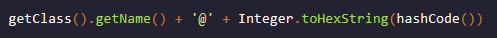
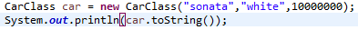

## toString 메서드 (1)

새로운 클래스를 작성하면 눈에 보이지 않지만 toString 메서드가 작성되어 있으며 이는 Object 클래스에 이미 toString 메서드가 정의되어 있기 때문입니다.

toString의 이해를 위해 기본적으로 작성되어 있는 Object toString 메서드를 호출하면 어떠한 결과가 반환되는지 이해할 수 있는 코드를 작성해 봅니다.
<br>

```
자바의 모든클래스는 최상위로 Object클래스를 상속받으며 Object클래스의 toString메서드를 사용할수있다.

기본적으로 toString 메서드는 this 객체를 "텍스트로 표현"한 문자열을 리턴 한다.

Object클래스의 toString메소드는 인스턴스 객체의 클래스 이름, '@'기호, 16진수로 표현된 객체의 해시코드로 구성된 문자를 리턴한다.
```
<br><br>

`Object클래스의 toString메서드 구조`
<br>

<br>

`인스턴스 객체 생성 및 출력 - invokes car.toString()`
<br>

<br>

`com.javalec.study3 패키지의 Carclass 참조변수 출력값`
<br>

<br>


참고 사이트 : https://johngrib.github.io/wiki/Object-toString/
