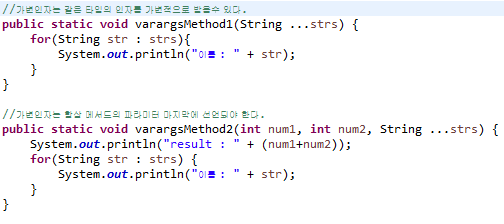
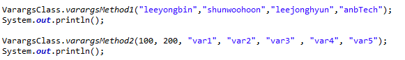
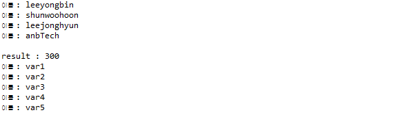
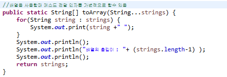
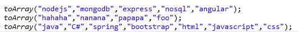
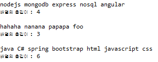

## 5. 고정인자 메서드와 가변인자(varargs, variable argument) 메서드

우리는 일반적으로 고정인자 메서드를 작성합니다.

Java 5 부터 가변인자 메서드 작성이 가능해졌는데요. 이를 코드로 작성해 보고 어떻게 활용할 수 있을지 고민해 봅니다.
<br>

```
가변인자(Varargs)
- JDK 1.5부터 메서드 매개변수의 개수를 동적으로 지정하여 구현 할 수 있다.
- (타입..변수명)으로 사용한다.
- 구조
  자료형 함수명(자료형...매개변수명){
      내용;
  }
```
<br>

```
가변인자 사용시 주의점
- 가변인자는 여러개 사용될 수 없다.
- 가변인자는 항상 파라미터 마지막에 존재해야한다.
- 가변인자 사용시 인자를 넣지않아도 정상적으로 실행되므로, 의도치 않은 결과를 일으킬수 있다.
- 의도치 않은 결과를 방지하고자 가변인자 사용시 가변인자의 길이에 대한 Exception을 사용하거나, 방어적 코드를 기재 해야한다.
```
<br>

`가변인자 Method선언`
<br>

<br>


<br>


`가변인자 출력결과`
<br>

<br>


`가변인자 활용`
<br>

<br>

`매개변수를 가변적으로 사용 할 수 있다.`
<br>

<br>

`출력결과`
<br>

<br>

``` 
전달하는 인자수가 너무 작아 ArrayList 사용하기가 애매하거나,
고정적으로 크기를 주어 배열을 사용하기에는 수를 예측 하기가 힘들경우.
가변인자를 사용하여 배열의 값을 가변적으로 사용 할 수 있다.
```
