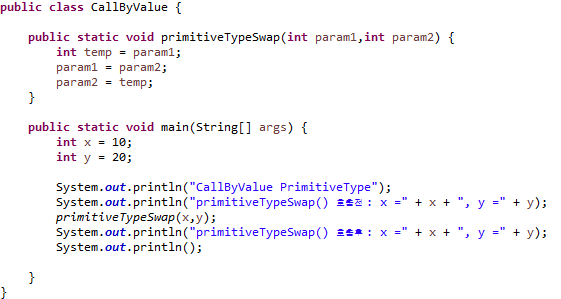

## 6. call by value, call by reference (1)

Java는 Call by Reference을 지원하는 걸까요? 어쩌면 매우 어려운 질문일지 모릅니다.

이해하기 앞서 다음의 코드를 순서대로 작성해 봅니다.

•primitive Type과 Reference Type을 인자로 받는 메서드를 코드 작성

•이어서 메서드 안에서 primitive Type의 값과 Reference Type의 상태를 다른 값으로 할당하고 System.out 으로 출력하는 코드 작성

•이어서 메서드 동작이 끝난 이후에 System.out 으로 2개의 변수를 출력하는 코드 작성
<br>

```
Call By Value : 메서드 호출시에 사용되는 인자의 메모리에 저장되어 있는 값(value)을 복사하여 보낸다.
즉 메서드 내부에서 수행한 연산은 main()에 존재하는 x와 y가 아닌,
swap메서드 내부에 새로 생성된 param1, param2은 다른 메모리 주소를 가르키기 때문에
메서드 수행 후에도 연산 결과값이 변하지 않는다.
```

`callByValue`
<br>

<br>

`출력 결과`
<br>

<br>

```
Call By Reference : 메서드 호출시 사용되는 인자가 값이 아닌 주소(Address)를 넘겨줌으로써
주소를 참조(Reference)하여 데이터를 변경 할 수 있다.
callByValue와 달리 CallByReference의 swap() 메서드는 실제 10과 20 값이 저장된 메모리주소를 참조하여 연산하기 때문에,
연산 결과에 따라 원본 데이터가 변하게 된다.
```

`callByReference`
<br>

<br>

`출력 결과`
<br>

<br>


참고사이트 : https://re-build.tistory.com/3
