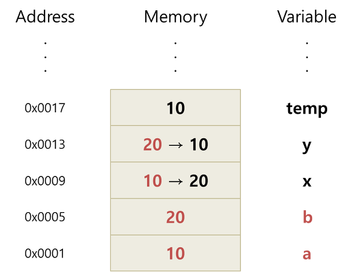
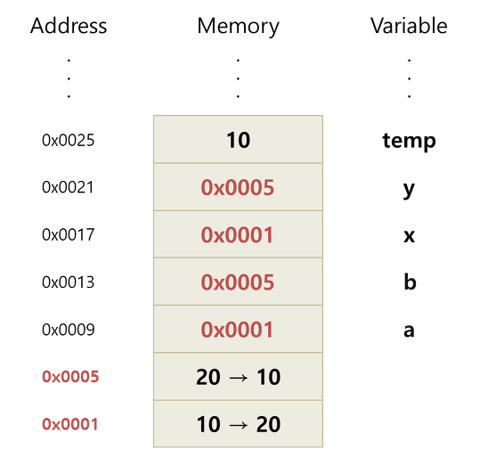
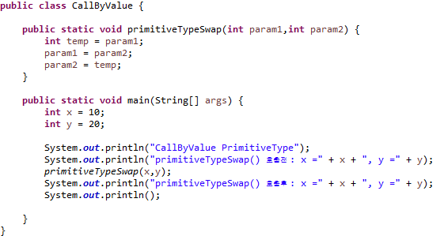
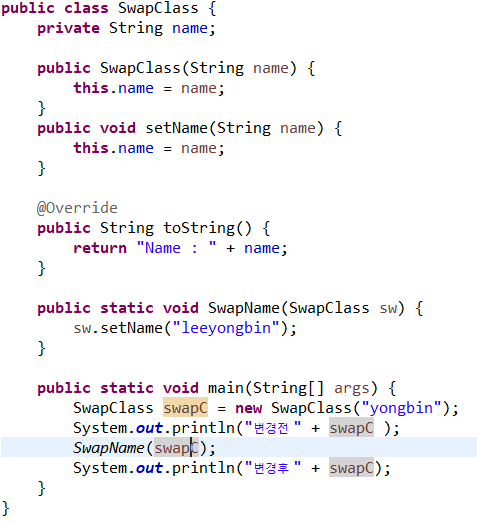

## 7. call by value, call by reference (2)

다양한 글들을 찾아보고 스스로 결론을 내려보고 그 내용을 글로 작성해 봅니다.
  

### 1. 글작성 목적
 

내가 처음 CallByValue와 CallByReference라는 용어를 접할때 참 난해했다.  

값에 의한 호출? 참조에 의한 호출? 용어만 보고서 뜻을 이해하기 힘들었고 C언어, JAVA언어의 기본서 책을 봐도 항상 실린 내용이었지만  

책에서 항상 나오는 내용이지만 별로 중요하지 않다고 생각하여 예제만 한번 실행 해보고 "아~ 이런거구나" 하고 넘어가서  

예전부터 메서드 인자 전달방식인 `CallByValue`와 `CallByRefenrece`의 개념이 정확하게 머릿속에 잡히지 않았다.  

과제를 하기 위해서, 또한 머릿속에 확실한 개념 잡도록 여러 참조글들을 토대로 글을 작성하였다.  

이글의 목적은 기본적으로 `CallByValue`와 `CallByReference`의 개념에 대해 알아보고, 간단한 예제 코드를 통하여  

java에서는 메서드로 전달된 인자에 대하여 어떤 방식으로 사용하는지에 대한 내용으로 글을 작성하고자 한다.
   

### 2. CallByValue, CallByReference란? 
 

CallByValue와 CallByReference의 간단한 정의 및 특징은 아래의 내용과 같다.
  

+ `CallByValue란 값에 의한 호출이다.`
  + 가장 일반적인 함수 호출의 형태로 호출 방식은 `값의 복사` 형식이다.
  + `callbyValue`방식의 caller는 인자값을 복사 방식으로 넘겨 주고, callee가 속한 메서드 범위내에서 어떤 작업을 하더라도 caller는 영향을 받지 않는다.
  + 함수가 호출될 때, 메모리 공간안에는 함수를 위한 별도의 임시 공간이 할당된다.
  + 복사된 인자는 함수 안에서 지역적으로 사용되는 `local value`의 특성을 갖는다.
    

  

+ `CallByReference란 참조에 의한 호출이다.`
  + 함수 호출시 변수의 주소를 전달해 인자로 전달된 주소가 가르키는 변수의 조작을 함수 내에서 가능하게 한다.
  + 함수 호출시 인자로 전달되는 변수의 레퍼런스를 전달한다.(메모리 주소값)
  + 함수안의 인자의 값이 변경되면, argument로 전달된 객체의 값도 함께 변경된다.
  

  

그렇다면 java의 메서드 인자전달방식은 `CallByValue` 인가? `CallByReference` 인가?  
java는 `CallByValue`방식을 사용한다.  
Reference타입의 인자를 메서드로 전달할때 메모리에 저장된 주소값을 복사하여 전달하는데  
이것 역시 물리적 관점에서 보면 값으로 볼 수 있기 때문이다.  
아래에 간단한 코드를 통해 설명 하겠다.  

### 3. 예제코드
 

 

`출력 결과`
 

  

예제코드와 결과값을 보면 CallByValue 메소드를 호출하고 매개변수로 x와 y값을 전달하였고,  

메소드 내부에서 param1, param2, temp 지역변수를 통하여 인자로 받은 두 값을 교환하는 로직이 수행되었다.  

하지만 출력결과에서는 두 값이 변하지 않았다.  

Primitive타입의 인자를 메서드로 전달할경우 전달되는 인자값은 메모리상에 저장된 메모리주소를 가리키는 주소값이 복사되지않고  

10,20 값을 복사해서 전달하기 때문에 primitiveTypeSwap 메서드() 내부에서 연산을 수행한 변수들은  

main()에 존재하는 x와 y가 아니라 메서드 내부에 지역변수로 새로 생성 되어 stack 영역에 push되고  

내부에서 지역변수로 사용이 되어 메소드 호출이 끝나면 자동으로 stack영역의 메모리상에서 pop되기 때문에  

호출이 끝난 후에도 메서드 내부에서 처리된 로직에 의해 값이 바뀌지 않는다는 것을 알 수 있었다.  

 

 

 

 

  

위의 2번째 코드결과를 보면 값이 바뀐것을 볼 수 있다.  

메서드로 전달하는 변수가 레퍼런스 타입의 경우에는 그 래퍼런스 변수가 가지는 값이 레퍼런스(주소 값)이므로  

SwapName메서드의 인자값으로 레퍼런스(주소값)가 복사되어 전달된다.  

클래스의 객체를 생성하여 값을 전달하게 되면 레퍼런스변수가 저장한 값이 주소값이기 때문에  

stack영역에 새로 생성된 레퍼런스변수sw는 레퍼런스변수SwapC와 동일한 Heap영역의 메모리 주소를 가리키고  

클래스 내부의 setName메서드를 통하여 SwapC가 가리키는 속성값에 접근하여 변경된 결과가 메서드 종료 후에도  

main() 메서드로 돌려지게 된다는걸 알 수 있었다.  

  

### 4. 결론
  + 자바는 `primitive`타입과 `reference`타입이 존재하지만, 메서드 호출시 둘다 `call by value` 인자 전달 방식을 가진다. 

  + 정확히 표현하면 java는 `change to status in reference` 로 정의할 수 있다. 

  + 자바에서는 C와 C++과 다르게 포인터가 없기때문에 `직접 메모리에 접근`하여 대상을 변경 하는것은 불가능 하다. 

  + 자바는 메소드에 객체의 레퍼런스값를 전달하고 그것을 통해 객체의 값을 바꿀 수 있다. 

  

참고사이트 :

http://mussebio.blogspot.com/2012/05/java-call-by-valuereference.html

http://www.yunsobi.com/blog/480

https://okky.kr/article/32431
