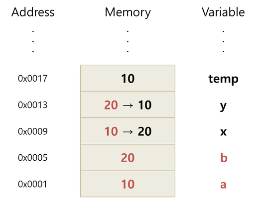
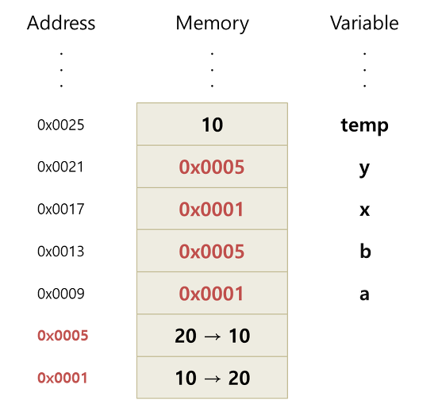

## 7. call by value, call by reference (2)

다양한 글들을 찾아보고 스스로 결론을 내려보고 그 내용을 글로 작성해 봅니다.
 

`CallByValue 값에 의한 호출`
 

  

  + 가장 일반적인 함수 호출의 형태로 호출 방식은 `값의 복사`로 이루어진다.
  + `callbyValue`방식의 caller는 인자값을 복사 방식으로 넘겨 주고, callee 내에서 어떤 작업을 하더라도 caller는 영향을 받지 않는다.
  + 함수가 호출될 때, 메모리 공간 안에는 함수를 위한 별도의 임시 공간이 할당된다.
  + 복사된 인자는 함수 안에서 지역적으로 사용되는 `local value`의 특성을 갖는다.
  + Java의 경우 함수에 전달되는 인자의 데이터 타입(Primitive/Reference)에 따라 함수 호출 방식이 달라진다.
  

`CallByRefenrece 참조에 의한 호출`
 

  

  + 함수 호출시 변수의 주소를 전달해 인자로 전달된 주소가 가르키는 변수의 조작을 함수 내에서 가능하게 한다.
  + 함수 호출시 인자로 전달되는 변수의 레퍼런스를 전달한다.(메모리 주소값)
  + 함수안의 인자의 값이 변경되면, argument로 전달된 객체의 값도 함께 변경된다.
  

참고사이트 : http://mussebio.blogspot.com/2012/05/java-call-by-valuereference.html
