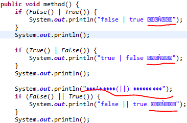
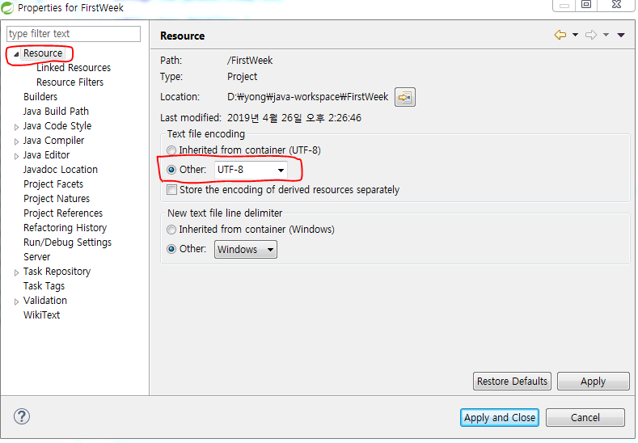
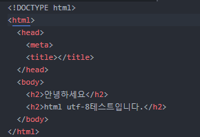
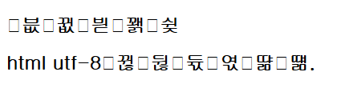
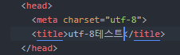

## 2. Character Set
  개발하면서 흔히 접할 수 있는 캐릭터셋을 요약하고 주로 사용하는 통합 개발 환경(IDE)에서
  어떻게 캐릭터셋을 설정하고 유의해야 할 사항들을 정리합니다.

  + **문자셋(Charset)과 인코딩**
    + 문자셋 (Charset, Character Set)
      + 하나의 언어권에서 사용하는 언어를 표현하기 위한 모든 문자,기호의 집합
      + 컴퓨터에서 문자를 표현 하기위해, 각 문자를 정수값에 대응 시켜 놓은 체계
      <br>

    + 인코딩 (encoding)
      + 컴퓨터가 이해할 수 있는 바이트와의 매핑 규칙
      + 문자를 표현하는 정수값을 bit배열로 표현 하는 것
      `문자셋을 어떻게 매핑하느냐에 따라 하나의 문자셋이 다양한 인코딩을 가질수 있음`
      <br><br>

+ **인코딩 (Encoding) 종류**
  + `ASCII`
    + 최초의 문자열 인코딩
    + 7bit로 구성, 영어를 위한 문자, 숫자, 특수문자, 기호등 128개 문자를 표현이 가능
    + 영어만을 고려하여 만들어졌으며, 일본어, 중국어 등 다른 언어는 표현이 불가능
    <br>

  + `ANSI`
    + ASCII이후 영문외에 다른 언어를 지원해야 할 필요가 생겨 만들어진 인코딩 방식
    + 8bit로 구성되어 있으며 256개의 문자를 표현 가능
    + ANSI의 앞 7bit는 ASCII와 동일하고, 뒤에 1bit를 이용하여 다른 언어의 문자를 표현한다.
    + 이를 CodePage라 하며 각 언어별로 Code값을 주고, Code마다 다른 문자열 표를 의미하도록 정의
      `CodePage : ANSI = ASCII(7bit) + CodePage(1bit)`
    <br>

  + `EUC-KR(Extended Unix Code-Korea)`
    + 한글 지원을 위해 유닉스 계열에서 나온 완성형 코드 조합
      `완성형 코드 : 완성된 하나하나마다 코드번호를 부여한 것`
    + EUC-KR은 2,350자의 한글을 표현가능
    + 완성형 인코딩방식, 한글을 2byte로 사용하는 문자집합(Character Set)
    + EUC-KR은 ANSI를 한국에서 확장한 것으로 외국에서는 지원이 안 될 가능성이 높다.
    <br>

  + `CP-949(Code Page949)`
    + 한글 지원을 위해 윈도우즈 계열에서 나온 확장 완성형 코드 조합
    + EUC-KR은 2bytes의 완성형 코드로 2bytes 내에서 표현할 수 있는 완성된 문자의 수는 한계가 있었고 이러한 문자를 해결하기위하여 마이크로소프트에서 EUC-KR을 개선 및 확장하여 만든 것.
    + CP-949는 11,172자의 한글을 표현가능
    + 949는 페이지 번호를 의미하며 한국을 의미한다.`일본-CP932, 중국-CP936`
    + 기본적으로 EUC-KR과 호환이 되며, EUC-KR에서 표현이 되지 않는 문자는 조합을 하여 표현한다
    <br>

  + `UNICODE`
    + 전 세계의 모든 문자를 컴퓨터에서 일관되게 표현할 수 있도록 고안된 코드 조합
    + 유니코드는 전세계 거의 모든 문자를 2bytes숫자로 1:1 매핑 시키는 '방식'을 말하고, 유니코드를 표현하는 여러가지 '인코딩' 방식들이 존재한다.`utf-8,utf-16등`
    + ASCII와 호환이 가능하면서 유니코드를 표현할 수 있는 `utf-8` 인코딩이 현재 많이 사용되고 있다.
    <br>

  + `UTF-8 (Universal Coded Set + Transformation Format - 8bit)`
    + 조합형 방식의 문자집합(Charater Set)이면서 유니코드 인코딩 방식중 하나이다.
    + 유니코드를 위한 가변 길이 문자 인코딩(멀티바이트) 방식 중 하나로, ANSI의 단점 보완을 위해 만들어졌다.
      `멀티바이트 : 표현해야 하는 문자에 따라 글자 크기를 가변으로 변경하여 사용하는 것`
    + UTF-8은 멀티바이트 개념을 사용하여 하나의 CharacterSet에 거의 모든 문자를 표현한다.
    + UTF-8은 멀티바이트(1~4bytes)로 최대 1,112,064자 까지 표현이 가능하다.
    + UTF-8은 인터넷에 교환되는 대부분의 파일에 사용된다.
    + **어느 문자든 공통으로 사용하는 인코딩 방식이며 현재 가장많이 사용되고 있다.**
    <br>

  + `UTF-16 (Universal Coded Set + Transformation Format - 16bit)`
    + 조합형 방식의 문자집합(Charater Set)이면서 유니코드 인코딩 방식중 하나이다.
    + 주로 사용되는 기본 다국어 평면(BMP)에 속하는 문자들은 그대로 16bit값으로 인코딩이되고 그 이상의 문자는 특별히 정해진 방식으로 32bit로 인코딩 된다.
    + UTF-16 인코딩은 유니코드 한 문자를 나타내기 위해 2byte ~ 4byte까지 사용한다.
    + UTF-16은 윈도우 응용프로그램, 자바스크립트등의 작동시 사용된다.
    + 영문 byte 수 :2byte , 한글 byte 수 : 2byte
    <br>

  + `UTF-8 vs UTF-16`
    + 두 Encoding 방식의 큰 차이는 최소 8bit가 필요하냐 16bit가 필요하냐 이다.
    + 최적의 상황(저장, 통신 용량을 고려해야 할때)에 따라 선택 기준이 다르다.

        | 인코딩 | 영문 바이트 수 | 한글 바이트 수 |
        |:---:|:---:|:---:|
        | `UTF-8` | 1 | 3 |
        | `UTF-16` | 2 | 2 |
        <br>

+ **인코딩 간의 문제점(유의사항)**
  + **이클립스에서 Encoding설정을 하지않고 Project를 Import할 시 한글 깨짐 현상을 볼 수 있다.**
     `Default로 euc-kr 문자열 인코딩 타입이 설정 되어있기 때문에 발생`
      
      <br>
  + `해결방법1` : 메뉴탭 - Window - Preferences - General - ContentTypes - Java Source File - Default encoding(UTF-8) Update
  + `해결방법2` : Project 우클릭 - Properties - Resources - Other - UTF-8
    
  <br><br>    

  + **웹에서의 한글처리**
    + 브라우저 인코딩값과 서버 인코딩값이 다를때 발생
    + HTML5 파일
    <br>
      
    <br>
    + Encoding방식을 `utf-8`로 명시하지 않은 경우 글자깨짐 발생
    <br>
      
    <br>
    + `해결방법` : head태그 사이에 meta태그로 `charset utf-8`를 명시해야 글자가 올바르게 출력 된다.
    <br>
      
    <br><br>

+ **통합개발환경(IDE) Eclipse UTF-8 설정 방법**
```
   Window - Preferences - General - Workspace - Text File encoding - UTF-8(update)
   Window - Preferences - General - Content Type - Java Class File - Default encoding(UTF-8)
   Window - Preferences - General - Editors - Text Editors - Speling - Encoding - Default(UTF-8)
   Window - Preferences - Web - CSS Files - Encoding(Unicode(UTF-8))
```
<br>

+ **Oracle Encoding 설정방법**
```
  1. 현재 설정된 인코딩 확인
  select * from nls_database_parameters where parameter like '%CHARACTERSET%';  
  SQL> select VALUE$ from sys.props$ where name='NLS_LANGUAGE';

  2. DB서버를 UTF-8으로 인코딩 설정후 오라클 재시작
  update sys.props$ set value$='UTF8' where name='NLS_CHARACTERSET';
  update sys.props$ set value$='UTF8' where name='NLS_NCHAR_CHARACTERSET';
  update sys.props$ set value$='KOREAN_KOREA.UTF8' where name='NLS_LANGUAGE';
  shutdown immediate;
  startup;
```
<br>

+ **요약**
  + 현재 한국에서 많이 사용되는 인코딩(Encoding) 방식은 크게 `euc-kr`, `CP-949`, `utf-8`방식을 사용한다.
  + `euc-kr`, `CP-949`방식은 우리나라에서만 쓸 수 있도록 만든 코드이며 세계 어디에서나 공통으로 사용되는 인코딩방식이 아니기 때문에 다른언어를 사용하는 환경에서 한글 페이지를 제대로 볼 수 없는 문제가 발생한다.
  + 이를 해결하기 위해 새로운 인코딩 방식이 개발 되었으며 그 문제를 보완한 방식이 `utf-8`,`utf-16`이며 `utf-8` 인코딩 방식을 많이 사용한다.
  + 웹 서버, DB같은 경우에도` UTF-8`, `EUC-KR`등 인코딩을 서로 동일하게 맞춰야 정상적으로 문자표현이 가능하다.
  <br><br>

+ 참고사이트
  + 인코딩 개념정리 :  https://d2.naver.com/helloworld/19187
  + Oracle Charset 설정방법 : https://rocksea.tistory.com/241
  + 문자열 Encoding 종류 : https://onlywis.tistory.com/2
  + 통합개발환경(IDE) Eclipse UTF-8 설정 방법 : http://programmingskills.net/archives/536
  + UTF-8, UTF-16 비교 : https://goodgid.github.io/Unicode-And-UTF-Encoding/
