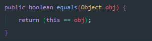
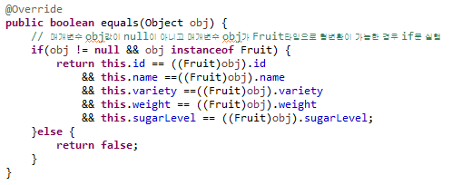
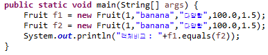

## 1. equals() 오버라이딩
 

equals 메서드는 두 개체가 동등(equivalence relation)한지 판단하기 위한 Object의 메서드입니다. 

우리는 모든 개체가 Object를 상속받고 있다는 것과 String 개체에 두개의 할당된 값이 같은지를 비교할때 

 equals 메서드를 사용하는 것을 알고 있습니다. 

 Object의 equals 메서드는 == 연산을 통해 비교하고 있으므로 우리가 원하는 결과를 반환 받지 못합니다. 

 그럼 상단의 Fruit의 개체가 같다는 걸 판단하기 위해서는 Object 개체의 equals 메서드를 오버라이딩해서 직접 구현이 필요합니다. 

Fruit 클래스에 equals 메서드를 오버라이딩하는 코드를 작성해 봅니다.
  

### 1. 글의목적
 

자바 프로그래밍을 하면서 객체가 동일한지 확인하는 방법은 대표적으로`==`연산자와, eqauls, hashcode 메서드가 있다.  

 그 중 `==`연산자와 object클래스의 equals특징과 이 둘 을 이용하여 개체를 비교하였을때 차이점을 알아보자.
  

### 2. eqauls() 메서드란?
 

`==`연산자와 equals 메서드의 특징을 간단히 알아보자.
  

+ `==`연산자의 특징
  + 객체의 참조(주소)값을 비교하는 `연산자`이다.
  + 두 객체가 동일한 `메모리 공간`을 가리키는지 확인한다.
  + `==`는 대상 객체를 비교한다.
  + `==`연산자는 객체를 직접 접근 할수 없다.
    

+ equals메서드의 특징
  + 객체간 내용(값)을 비교할 수 있는 `메소드`이다.
  + 객체가 가지고 있는 `값`을 비교하는데 사용한다.
  + 문자열의 데이터/내용을 기반으로 비교한다.
    

그렇다면 `==` 연산자와 equals메서드의 차이는 무엇인가?
  + `==`연산자는 비교하는 두 객체가 같은것을 가리킬때만 true값을 리턴한다.
  + equlas는 객체 자신의 값과 주어진 객체(obj)값을 비교한다.

equals 메소드를 override 통해서 다른 주소값을 같는 객체가 의미상 똑같은 객체라는 것을 Java가 인식할 수 있게 한다.  

간단한 예제 코드를 통해 알아보자  

### 3. 예제 코드
  

`Object에 정의된 equals`
 

 

`eqauls 메서드 Override`
 

 

`객체 비교`
 

 

`출력 결과`
 

 

### 4. 결론
 

eqauls를 override한 후, 매개변수로 전달된 매개변수는 object 타입이므로 동일한 Fruit 타입으로 형변환 한 후 두 객체에 값을 비교한다.
  
