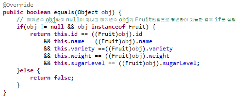
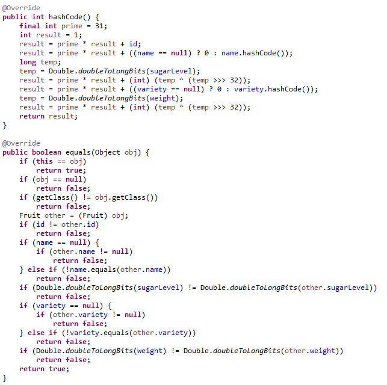
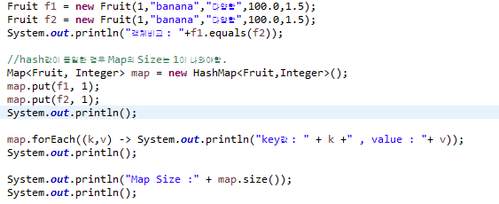
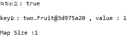

## 2. equals() 구현 검증
 

직접 작성한 코드와 Eclipse에서 제공하는 generator를 이용하여 작성된 equals 메서드와 어떠한 차이가 있으며,   

내가 작성한 equals 메서드에서 보완되어야 하는 내용에 무엇이 있는지 이해해 봅니다.  

•Source -> Generate hashCode() and equals() ...  

`작성 코드`
 

  

`Generator를 이용하여 자동 완성된 코드`
 

  

`hash값 비교`

  

`hash값 비교결과`

  

equals() : 두 객체의 값(문자열)이 같은지 확인하는 Method
  

hashcode() : 두 객체가 같은 객체인지 확인하는 Method
  

IDE generator를 통하여 eqauls 메서드와 hashcode 메서드를 자동 생성 할 수 있다.  
  

직접 작성한 코드는 eqauls()메소드 재정의만 작성하여 객체의 값이 동일한지만 비교를 하였다.  

하지만 hash를 사용하는 Collection(HashSet,HashMap) 등을 비교시 예기치 않은 문제가 발생한다.`hash 값 일치X`  

즉, eqauls로 같은 객체라면 반드시 hashCode값도 같은 값 이여야한다.  

결론 : 만약 hashcode를 재정의하지 않으면 같은 객체는 같은 해시코드 값을 가져야 한다는 규약에 위반 된다. 
       그러므로 객체동등 비교를 할때 equals()메소드와 hashCode()메소드를 같이 재정의 해주어 사용한다.  

참고사이트 : http://wonwoo.ml/index.php/post/668
