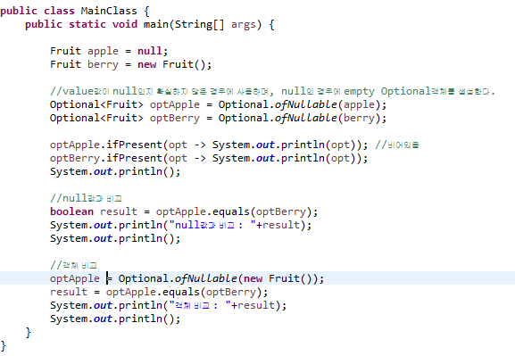

## 3. equals()과 null 처리

```
private void diff(Fruit apple, Fruit berry) {
    apple.equals(berry);
}
```
<br>

위 메서드가 호출되기 전 다음의 두가지 형태로 각각의 Fruit 개체에 값이 할당 되었습니다.
<br>

```
Fruit apple = new Fruit();

Fruit berry = null;
```
<br>

```
Fruit apple = null;

Fruit berry = new Fruit();
```
<br>

둘중 하나의 케이스에서 NPE(NullPointException)가 발생될텐데요. 해당 Exception을 어떻게 처리하는 것이 보다 현명한 선택인지 고민해 봅니다.
<br><br>


프로그램에 널 값을 가지는 객체 참조를 하면 에러가 발생하므로 두번째 코드에서 NullPointerException 에러가 발생 된다.
<br><br>

NullPointerException이 발생하는 경우
<br>

+ null객체에서 method를 호출하는 경우
+ null객체의 필드에 접근하거나 값을 변경하는 경우
+ null의 길이를 배열처럼 취하는 경우
+ null을 throw 하는 경우
+ null을 통해 동기화 할 경우
<br><br>

### 방어적 기재 코드 사용
<br><br>

### equals()
<br>

```
private static void diff(Fruit apple, Fruit berry) {
  //방어적 기재코드1
  if(apple!=null && apple.equals(berry)) {
    System.out.println("두 객체는 동일합니다.");
  }else {
    System.out.println("두 객체는 동일하지 않습니다.");
  }

  //방어적 기재코드2
  public void method(String apple, String berry){
      if(Objects.equals(apple, berry)){
      }
  }
}
```
<br><br>

이런식으로 방어 코드를 작성할 경우, null값을 체크해야될 경우가 많아질수록 지저분한 코드가 발생될 수 있다.
<br><br>

Java8에서 함수형 언어의 접근방식에서 영감을받아 Optional<T> 라는 새로운 클레스를 도입하였으며 이를 통해 NullPointException에러를 해결 할 수 있다.<br><br>

### Optional 이란?
<br>

+ `Optional`은 존재할 수도 있지만 안 할 수도 있는 객체, 즉 null이 될 가능성이 있는 객체를 감싸고 있는 일종의 Wrapper 클래스이다.
<br><br>

+  직접 다루기에 위험하고 까다로운 null을 담을 수 있는 특수한 그릇이다.
<br><br>

+ Optional을 사용하면 NPE를 유발할 가능성이 있는 null을 직접 다루지 않아도 된다.
<br><br>

+ Optional을 사용함으로써 null체크를 직접하지 않아도 된다.
<br><br>

+ 명시적으로 해당 변수가 null일 수도 있다는 가능성을 표현할 수 있다.
<br><br>

### 코드작성
<br><br>

`코드`
<br>


<br><br>

`출력결과`
<br>


<br><br>

Optional을 사용함으로써 null처리를 직접하지 않고도 가독성좋은 코드를 작성할수 있다.  

참고사이트 : https://multifrontgarden.tistory.com/205
            https://advenoh.tistory.com/15
<br><br>
