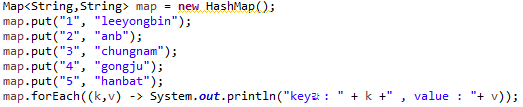
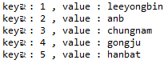
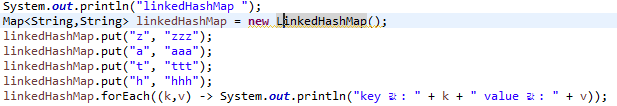
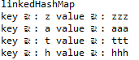
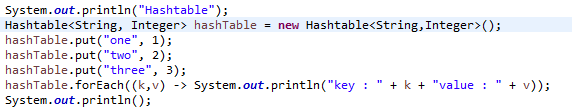
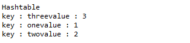
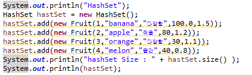
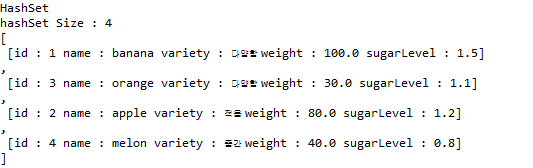

우리는 다음주 hashCode 메서드에 대해서 학습할 예정입니다.
<br><br>

이를 위해 hash를 사용하는 컬렉션에 대해서 찾아보고 이를 사용하는 코드를 작성하여 그 특징들을 이해하도록 합니다.
<br><br>

다음은 내용 정리를 위해 참고할만한 블로그의 링크입니다.
<br><br>

•http://rangken.github.io/blog/2015/java.map/
<br>

•https://jdm.kr/blog/197
<br>

본인이 작성한 글과 비교하여 부족한 부분을 채워넣고 블로그 글에서의 부족한 부분도 본인의 글에 추가로 작성합니다.
<br><br>

공식 레퍼런스와 도큐먼트에서는 어떠한 내용을 설명하고 있는지도 찾아보도록 합니다.
<br><br>

## Hash를 사용하는 컬렉션 종류 및 특징
<br><br>

### 1. HashMap
<br>

+ 내부적으로 Entry<K,V>[] Entry의 array로 되어 있다.
+ 해당 array에 index는 내부 해쉬 함수를 통해 계산된다.
+ key, value에 `null값을 입력할 수 있다`.
<br><br>

`HashMap 코드`

<br>

`HashMap 출력`

<br>


### 2. LinkedHashMap
<br>

+ 기본적으로 HashMap을 상속받아 HashMap과 유사하다.
+ 키값은 입력 순서대로 출력되어 나온다.
+ 입력순서를 유지하고 싶으면 LinkedHashMap을 사용하자
<br><br>

`LinkedHashMap 코드`

<br>

`LinkedHashMap 출력`

<br>

### 3. HashTable
<br>

+ Dictionary를 상속받으며 Cloneable, Serializable 을 구현한다.
+ key, value값에 null을 허용하지 않는다.
+ putIfAbsent 메서드를 가지고있다.
+ HashMap에 비해 느리지만 동기화를 지원한다.
<br>

`HashTable 코드`

<br>

`HashTable 출력`

<br>

```
자주 사용하는 메서드

put, get : 해당 콜렉션의 값을 넣거나 가져온다.

clear() : 해당 콜렉션의 데이터를 초기화 한다.

containsKey(key) : 해당 콜렉션에 입력받은 value를 가지고 있는지 체크한다.

containsValue(value) : 해당 콜렉션에 입력받은 value를 가지고 있는지 체크한다.

isEmpty() : 해당 콜렉션이 비어 있는지 체크한다.

size() : 해당 콜렉션의 Entry , Segment 사이즈를 반환한다.

```

### 4. HashSet
<br>

+ 가장 빠른 임의 접근 속도를 가진다.
+ 순서를 예측할 수 없다.
+ 중복을 허용하지 않는다.
<br>

`HashSet 코드`

<br>

`HashSet 출력`

<br>
