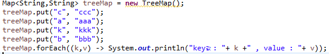
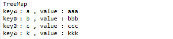
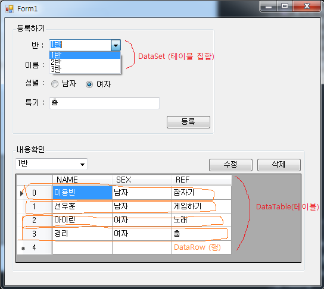

## C# 자료구조(Collection)


### 1. 글의목적
<br>
자주 사용하는 Collection종류와 특징들을 알아보고 간단한 코드를 통해 사용방법을 익히자<br><br>

### 2. Collection 종류 및 특징
<br>

대표적으로 자료구조는 `List` , `Set` , `Map` 으로 크게 분류할 수 있다.
<br><br>

각 자료구조의 특징은 아래와 같다
<br><br>


<br><br>


| 인코딩 | 영문 바이트 수 | 한글 바이트 수 |
|:---:|:---:|:---:|
| `List` | LinkedList<br> Stack<br> Vector<br> ArrayList | 순서가 있는 데이터 집합<br> 데이터의중복을 허용 |
| `Set` | HashSet<br> TreeSet<br> | 순서를 유지하지 않는 데이터 집합<br> 데이터의 중복을 허용 안함  |
| `Map` | HashMap<br> TreeMap<br> HashTable<br> Properties<br> | 키(key)와 값(value) Pair구조<br> 순서 유지하지 않음<br> 키 중복 허용하지 않음<br> 값 중복을 허용|

<br><br>

### ArrayList
<br><br>

+ 배열과 비슷한 컬렉션이다. 배열처럼 [ ] 인덱스로 컬렉션 요소에 접근이 가능하며, 특정 요소를 바로 읽고 쓸 수 있다.
+ ArrayList는 크기 지정없이 요소의 추가, 삭제에 따라 자동으로 가변적인 크기를 갖는다.
+ 또한, ArrayList 컬렉션 하나로 모든 타입의 변수를 담을 수 있다.
+ 주로 사용하는 함수는 Add, Insert, Remove, RemoveAt 등이 있다.

```
static void Main(string[] args)
{
    ArrayList arrayList = new ArrayList();
    arrayList.Add("Hello");
    arrayList.Add("World");
    arrayList.Add("!");
    printValues(arrayList);

}

public static void printValues(IEnumerable arrayList)
{
    foreach (string str in arrayList)
        Console.Write(" {0}", str);
    Console.WriteLine();
}

```
<br>

### TreeMap
<br><br>

+ 이진검색트리의 형태로 키와 값의 쌍으로 이루어진 데이터를 저장한다.
+ 키값에 대한 Compartor 구현으로 `정렬 순서를 바꿀 수 있다`.
+ 트리에 저장되므로 `키 값은 일정 기준으로 정렬된 상태`로 출력된다.
<br><br>

`TreeMap 코드`
<br>


<br><br>

`TreeMap 출력`
<br>


<br><br>

```
TreeMap은 출력결과를 보면 a,b,c,k로 키값이 정렬된 것을 볼 수 있다.
키값을 정렬하여 사용해야될 경우 TreeMap을 사용하자.
```
<br><br>


### Dictionary
<br><br>

+ 키값과 value값으로 이루어진 해시테이블 형태의 제네릭 컬렉션이다
+ 키는 고유값을 가지며 키값을 통해 값에 접근할수 있다. `유일성`
+ List Collection과 유사하나 Key 값을 별도로 등록해서 검색이 편하고 Key값이 유일성을 갖기 때문에 값들이 명확하다.

<br>

```
Dictionary<string, string> dic = new Dictionary<string, string>();
dic.Add("YB", "YONNGBIN");
dic.Add("WH", "WOOHOON");
dic.Add("ES", "EUNSANG");
dic.Add("GJ", "GIJUNG");
//키 값을 이용해서 값에 접근 할수있다.
Console.WriteLine(dic["YB"]);

//키가 존재하면 값이 대체된다.
dic["YB"] = "LEEYONGBIN";
Console.WriteLine(dic["YB"]);

//KEY값에 매핑되있는 value값을 제거할수있다.
dic.Remove(dic["YB"]);

//키의 존재 유무 판단에 따라 안전하게 Dictionary에 추가 할수 있다.
if (!dic.ContainsKey("ANB"))
    dic.Add("ANB", "ANBTech");
Console.WriteLine(dic["ANB"]);

// foreach를 이용하여 키,값에 접근할수 있다.
foreach(var v in dic)
{
    Console.WriteLine("Key = {0} , Value = {1} ", v.Key, v.Value);
}
```
<br><br>

### DataSets
<br><br>

+ 메모리내에 존재하는 DataTables의 집합이다.
+ 일관성 있는 관계형 프로그래밍 모델을 제공하는 데이터의 메모리 상주 표현이다.
+ 데이터를 포함하고 제약하며 데이터의 순서를 지정하는 테이블과 각 테이블 간의 관계를 포함하는 데이터의 완전한 집합을 나타낸다.
<br><br>

### DataTables
<br><br>

+ 메모리 내 데이터의 하나의 테이블을 나타낸다.
+ DB스키마를 정의하고, 컬럼 및 로우Data를 세팅하여 테이블을 표시한다.
<br><br>

### DataViews
<br><br>

+ 데이터 바인딩 응용프로그램에서 자주 사용되는 기능이다.
+ DataView를 통하여 DataTable에 저장되어 있는 데이터에 대해 서로 다른 뷰를 만들수 있다.
+ DataView는 데이터를 저장하지 않으며, 해당DataTable의 연결된 뷰를 나타낸다.
<br><br>


### 3. DataSet과 DataTable를 이용한 간단한 프로그램
<br><br>


<br><br>

```
DB와 연동하여 사용할 경우 DataSet에 DB에서 받아온 Select Data값들에 대해 DataTable객체로 보유한다.

DataSet은 비연결지향적이다. 데이터 베이스의 내용을 메모리 데이터베이스 형태로 보유하며 필요시마다 DB에서 갱신하여 사용한다.

DB와의 한번의 연결로 Select를 통하여 가져온 데이터를 n개의 DataTable형태로 가지고 있다.

```
<br><br>


참고자료 : https://jdm.kr/blog/197
          https://docs.microsoft.com/ko-kr/dotnet/framework/data/adonet/dataset-datatable-dataview/
          https://mrw0119.tistory.com/16
          https://cwkcw.tistory.com/122
