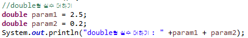
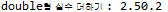
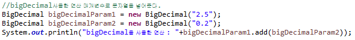
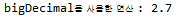

##3. 부동 소수점

float는 소수점이 있는 실수 데이터를 저장할 수 있는 타입입니다.
부동소수점 방식의 특징과 부동소수점이 가진 단점을 보완할 수 있는 방법을 코드로 작성해 봅니다.

`부동소수점 특징`
  + 실수를 컴퓨터 상에서 표현시 소수점의 위치를 고정하지 않고 위치를 나타내는 수를 따로 표현
   
  + 유효숫자를 나타내는 `가수`와 소수점의 위치를 풀이하는 `지수`로 나누어 표현
   
  + float와 double의 기본자료형에 내포된 근사치 값 계산으로 정확한 수치 계산이 불가능
   `대부분 십진 소수는 정확하게 이진소수로 표현될 수 없고 이진 부동 소수점 수로 근사됨`
   
  + 이는 java.meth 패키지내 `BigDecimal` 클래스를 사용하여 해결가능하다
    `정확한 변환을 위해 매개변수를 문자열로 넣는다.`
   

`실수에 대한 연산시 오차 발생`
 
  
 

`실수연산 출력결과`
 
  
 

`java.math.bigDecimal 클래스사용`
 
  
 

`bigDecimal 클래스사용 출력결과`
   
  
 
