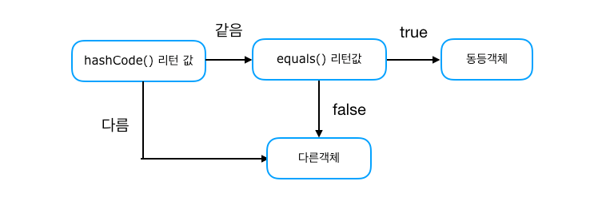
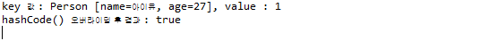

1.	hashCode() -------------

<br><br>

개체에 대한 해시코드(hash code) 값을 반환하는 Object의 메서드이며 해시코드는 16진수로 제공되는 메모리의 주소값 입니다.<br><br>

이 hashCode 메서드는 우리가 앞서 학습한 Map 인터페이스를 구현한 컬렉션 중에서 hash를 사용하는 컬렉션(Collection)의 경우 이 hashCode 결과를 키로 결정하게 됩니다.<br><br>

(Hashtable, HashMap, ConcurrentHashMap)<br><br>

equals 메서드로 동등하다면 hashCode 메서드의 결과도 동일하게 도출되어야 하며<br><br>

hashCode를 키로 사용하는 컬렉션에서 값을 다시 꺼낼때 원하는 값을 꺼낼 수 있기 때문입니다.<br><br>

String 객체에 구현되어 있는 hashCode 메서드를 참조하여 hashCode 메서드를 직접 구현해봅니다.<br><br><br>

객체 해시코드란 객체를 식별하는 하나의 정수값을 말한다.<br><br>

Object의 hashCode() 메소드는 객체의 메모리 번지를 이용해서 해시코드를 만들어 리턴하기 때문에 객체 마다 다른 값을 가지고 있다.<br><br>

객체의 값을 동등성 비교시 hashCode()를 오버라이딩할 필요성이 있는데, 컬렉션 프레임워크에서 HashSet, HashMap, HashTable은 다음과 같은 방법으로 두 객체가 동등한지 비교한다.<br><br>

<br><br>

```
Main
...

Person p1 = new Person("아이유",27);
Person p2 = new Person("아이유",27);

HashMap<Person,Integer> map = new HashMap<Person,Integer>();
map.put(p1,1);
map.put(p2,1);
System.out.println();

boolean compResult = p1.equals(p2);
map.forEach((k,v) -> System.out.println("key 값 : " + k + ", value : " + v));
System.out.println("hashCode() 오버라이딩 결과 : " + compResult);
System.out.println();

....


public class Person {
    private String name;
    private int age;
...

@Override
public int hashCode() {
  return Objects.hash(name,age);
}

@Override
public boolean equals(Object obj) {
  if(obj instanceof Person) {
    Person comparePerson = (Person) obj;
    if(this.name == comparePerson.name
       &&this.age == comparePerson.age) {
      return true;
    }
  }
  return false;
}

```

<br><br>

`출력결과`<br>

<br><br>

hashCode 메서드를 정의하지 않으면 리턴 하는 해시코드가 다르기 때문에 다른 식별키로 인식한다.<br><br>

hash()메소드를 통하여 주어진 매개값들로 배열을 생성하고 Arrays.hashCode(Object[])를 호출해서 해시코드 값을 얻고 이값을 리턴한다.<br><br>

Person 클래스 타입의 p1 과 p2는 다른 참조값 객체지만 , equals(), hashCode()메서드를 재정의 함으로써<br> hashCode의 리턴값이 동일하고, eqauls() 리턴값이 true로 나오기 때문에 두 객체는 동등 객체로 판단된다.<br><br><br>

이러한 이유로 정확한 객체의 동등 비교를 위해서는 Object의 equals(), HashCode()메서드를 같이 재정의 하여 논리적, 동등 객체일경우 동일한 해시코드값이 리턴되도록 해야 한다.<br><br>

참고 사이트 : https://minwan1.github.io/2018/07/03/2018-07-03-equals,hashcode/
