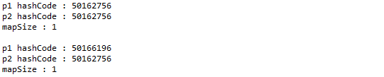

4 immutable과 mutable
---------------------

<br><br>

equals 메서드나 hashCode 메서드에서 비교 대상 멤버가 immutable 하지 않다면 (즉 mutable) 한 멤버는 비교의 대상으로 사용해서는 안됩니다.<br><br>

다음의 링크의 내용을 보고 hashCode 메서드 작성에 유의해야 하는 점을 이해해 봅니다.<br><br>

•https://blog.weirdx.io/post/3113<br><br>

-	mutable 객체란? (가변객체)<br>

	-	객체 내의 특정 요소를 변경 할 수 있는 객체
	-	List, ArrayList, HashMap 등..
	-	참조하고 있는 heap영역의 객체를 재사용<br><br>

-	Immutable 객체란? (불변객체)<br>

	-	Immutable이란 생성후 상태변경 (수정)이 불가한 객체이다
	-	String, Boolean, Integer, Float, Long 등...
	-	참조하고 있는 heap 영역의 객체가 바뀜<br><br>

```
Person p1 = new Person();
p1.setName("아이린");
p1.setAge(29);
System.out.println("p1 hashCode : " + p1.hashCode());

System.out.println();

Person p2 = new Person();
p2.setName("아이린");
p2.setAge(29);
System.out.println("p2 hashCode : " + p2.hashCode());

Map<Person, Integer> map = new HashMap<Person,Integer>();       
map.put(p1,1);
map.put(p2,1);
System.out.println(map.size());
System.out.println();

p1.setName("아이유");
System.out.println("p1 hashCode : " + p1.hashCode());
System.out.println(map.size());

```

`출력결과`<br>

<br><br>

출력 결과를 보면 p1.setName()을 통해 p1의 상태를 변경하여 hashCode값이 변경되었지만 이전에 hashCode값을 물고 있어 동일한 식별키로 인식 하는것을 볼 수 있었습니다.<br><br>

mutable객체는 put()하는 순간에 들어오는 오브젝트의 HashCode()값을 기억하고, 그 이후에 상태를 변경하여 hashCode값이 변경되어도 hashCode값을 인식하지 못하여 이전 hashCode값을 유지한다는것을 알았습니다.

변경이 불가능한 Immutable객체는 상태 변경시 heap영역에 새로운 오브젝트가 생성되며,또한 그 객체에 대한 새로운 hash값이 생성됨.<br><br>

하지만 mutable객체는 상태변경시 Imutable과 달리, Object가 heap영역에 새로 생성되지않고 기존의 Object를 재사용한다.<br>

`새로운 hash값 생성x`<br><br>
