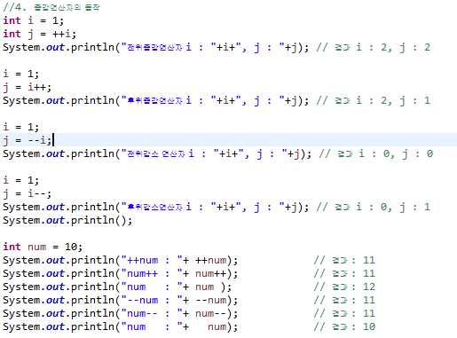
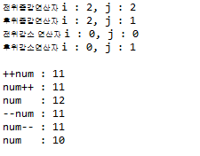

## 4. 증감연산자의 동작
증감연산자 ++와 —가 변수의 앞에 위치할 때와 뒤에 위치할 때의 차이를 확인할 수 있는 코드를 작성합니다.

  + 전위 증감 연산자는 변수자체의 값을 1증가/감소해서 반환한다.
     

  + 후위 증감 연산자는 다른 변수에 현재 변수 값을 저장하고 변수 값을 1증가/감소하고 이전에 저장된 값을 반환한다.
     

`Code`
 
  
 

`출력결과`
 
  
 
