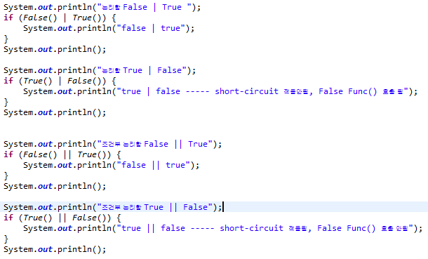
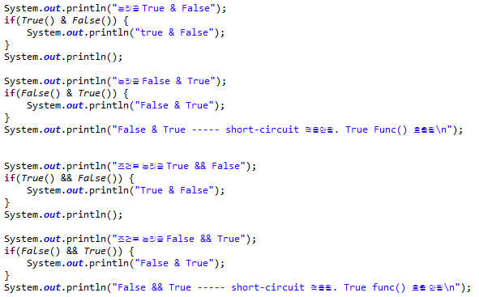
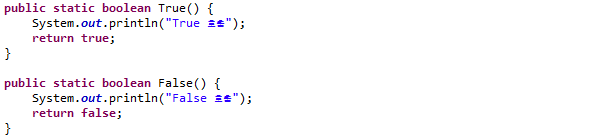
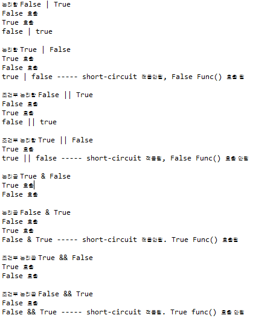

## 5. 논리 연산
  논리곱(&), 논리합(|), 조건부 논리곱(&&),조건부 논리합(||)의 차이점을 코드로 작성 합니다.
  작성된 코드로 조건부 논리곱과 조건부 논리합 만을 사용하는 이유를 찾아 봅니다.

  ```
    return 값으로 boolean 타입의 true, false를 반환하는 함수를 만들어 각 논리곱, 논리합, 조건부 논리곱, 조건부 논리합에 대한 testing 결과 출력  
  ```
+ `Code`
  <br>
  
  
  <br>

+ `function`
  <br>
  
  <br>

+ `출력 결과`
  <br>
  
  <br>

  ```
  즉, 코드에서 보이는 연산결과에서 보이는 것 처럼 논리합(|), 논리곱(&) 연산은 조건문의 조건이 만족하여도

  short-circuit 연산이 적용되지 않아 불필요한 연산을 하게되기때문에 조건부 논리합(||), 조건부 논리곱(&&)연산을 사용한다.
  ```
