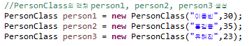

## 6. 객체 생성
  new 키워드를 이용하여 인스턴스화 할 수 있으며 이렇게 인스턴스화하여 생성한 개체를 인스턴스라 합니다.
  이 인스턴스는 메모리 힙 영역으로 할당되어 참조 주소가 생성되며 가비지 콜렉터에 의해 최종 소멸 됩니다.
  new 키워드를 이용하여 인스턴스화하는 코드를 작성해보고 작성된 코드 조각 하나하나를 풀어 한글로 설명해 봅니다.


```
  PersonClass : 클래스(객체)
  new : 객체를 인스턴스화 하는 Java의 예약어, new를 통해 객체의 인스턴스가 생성되어 Heap영역에 할당되며 독립적인 메모리 공간의 주소를 가르킨다.
  this : this는 객체 자기자신을 가리키는 예약어 이다.
  getter,setter : 클래스 내부에서 private로 선언된 속성을 클래스 외부에서 접근하기위해 사용되는 메서드이다.
```
+ `Class 선언`
  
  ```
   Class 구조

    접근제어자 class 클래스명 {
      //속성
      접근제어자 데이터타입 변수명;
      //생성자
      접근제어자 클래스명(매개변수1,매개변수2){
        this.속성명 = 매개변수1;
        this.속성명 = 매개변수2;
      }
      //메서드
      접근제어자 반환명 메서드;

    }

    클래스 내부 속성값은 외부에서 접근할수 없도록 private로 선언해주며 외부에서 직접 접근할수 없도록하고,
    클래스 내부의 public선언한 메서드를 통하여 외부에서 메서드를 통해 클래스 내부의 속성값에 접근하도록 한다.

    생성자가 없으면 Default생성자가 자동으로 생성되며, 생성자를 직접 만들어 클래스 내부의 속성값을 new를 통하여
    인스턴스객체 생성시 클래스내의 변수들을 초기화할 수 있다.

    this는 객체 자기자신을 나타내며, 매개변수로 받은 값들을 클래스 내부의 setter메서드를 통하여 클래스 내부에
    선언된 속성값에 접근할 수 있다.
  ```

+ `PersonClass의 인스턴스화`
  
  ```
  인스턴스화
    클래스명 참조변수명 = new 클래스명();
    new를 통하여 여러개의 독립적인 주소공간을 갖는 인스턴스 객체를 생성 할 수 있다.
    이 참조변수는 메모리(Heap영역)상에 값이 저장되어 있는 독립적인 주소값을 가르킨다.
    참조변수가 가르키는 주소가 null이거나 변경될 경우, 변경되기전 Heap메모리상에 Data은 가비지컬렉터에 의해 자동적으로 소멸된다.  
  ```

+ `getter메서드 사용 클래스 멤버(속성) 접근`
  
  ```
  getter
    클래스명.get필드명()으로 외부에서 private로 선언된 클래스 속성값에 접근 가능
  ```

+ `setter메서드 사용 클래스 멤버(속성) 값을 변경`
  

  ```
  setter
    클래스명.set필드명(value)으로 클래스 속성값 변경시 사용하며, setter를 통해 클래스내의 속성값을 변경 할 경우
    조건을 통해 값을 입력받아 안전장치 역할을 할 수 있다.
  ```


+ `참고사이트`
  + Heap영역 Test : https://wanzargen.tistory.com/17?category=700063
