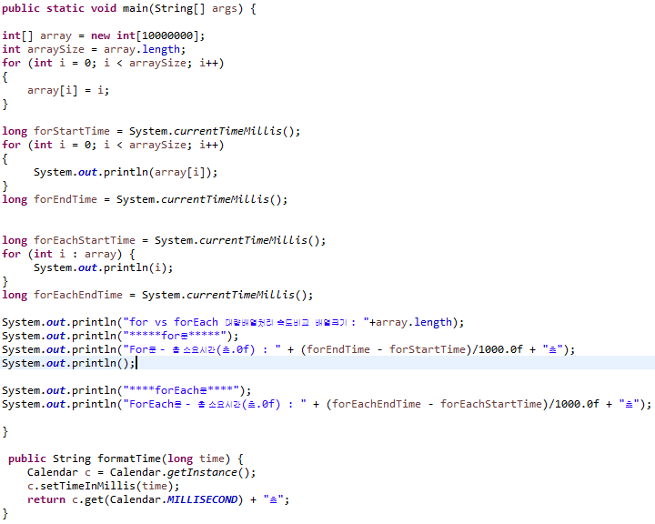

## 7. while, do while, for, foreach
  Java에는 다양한 반복문이 존재하며 차이가 있지만 반복문이라는 용어처럼 반복적인 작업을 구현할 때 작성하게 됩니다.
  반복문들의 차이점을 코드로 표현하고 읽기 좋은 코드 관점으로 보았을 때 어떤 반복문이 가장 큰 이점을 가지고 있는지 설명해 봅니다.

  + `반복문 구조`
```
  for문
    - 제어 변수를 사용하며 반복횟수가 정해져 있다.
    - 구조
      for( 초기화식; 조건식; 증감식){
         반복 작업 실행문
      }

  forEach문
    - 향상된 for문이라고 불린다.
    - 배열 또는 열거형 컬렉션의 각요소들을 순차적으로(index 0 - 끝까지) 리턴 해준다.
    - 구조
      forEach( 각 요소 값 : 배열,컨테이너 값){
         반복 작업 실행문
      }

  while문
    - 초기식과 증감식이 존재하지 않는다.
    - 조건식이 true일 경우, 게속해서 반복
    - 구조
      while( 조건식 ) {
         반복 작업 실행문
     }

  do..while문
    - 실행문 블럭을 무조건 한번 수행하고, 조건을 검사하여 반복을 결정한다.
    - 구조
      do{
         반복 작업 실행문
      }while(조건식);

```
<br>

   + `while문 code`
```
      int i = 0;
      int result = 0;
      while(i < 10) {
    	   i++;
    	    result += i;
    	     System.out.println("while문 " + i +"번째 값 : "+result);
      }
```
<br>

  + `do..while문 code`
```
    int i = 0;
    result = 0;
    do {
      i++;
      result += i;
      System.out.println("do..while문 "+ i +"번째  값 :"+result);
      }while( i < 10 );
```
<br>

  + `class가 담긴 ArrayList 사용`
```
    class가 담긴 ArrayList 사용
    PersonClass person1 = new PersonClass("이용빈",30);
    PersonClass person2 = new PersonClass("홍길동",27);
    PersonClass person3 = new PersonClass("유해진",32);
    ArrayList<PersonClass> personArrayList = new ArrayList<PersonClass>();
    personArrayList.add(person1);
    personArrayList.add(person2);
    personArrayList.add(person3);
```
  + `For문 code`
```
    for(i = 0; i<=personArrayList.size()-1; i++) {
  	 for(int j=0; j<1; j++) {
  		PersonClass person = new PersonClass();
  		person = personArrayList.get(i);
  		System.out.println("PersonName : "+person.getName()+" , PersonAge : "+person.getAge() );
      	 }
      }    
```

  + `ForEach문 code`
```
    for(PersonClass person : personArrayList){
      System.out.println("PersonName : "+person.getName()+" , PersonAge : "+person.getAge());
    }
```
<br>

  + `forEach문을 사용하지 못하는 경우`
    + 순회하는 도중 특정한 원소를 찾거나 그값을 수정해야 하는 경우
    + 직렬이 아닌 병렬적으로 순회할 경우
  <br>

+ `For문 vs ForEach문 속도비교`
  
+ `결과1`
  <br>
  
  <br>
+ `결과2`
  <br>
  
  <br>
+ `결과3`
  <br>
  
  <br>

+ **요약**
  + 여러번 대량의 배열을 처리해본 결과 속도면에서 큰 차이는 없지만 forEach문이 약간 빠르다.
  + 수행결과가 적을 경우 for문이 빠를때도 있다.
  + list,array 객체를 처리할경우 size를 변수에 담아 처리하는 것이 size() 함수를 매번 호출하는 것보다 빠르다.
  + 배열이나 리스트,제네릭 타입을 통한 반복문 사용시 forEach문이 코드의 가독성 좋다.
